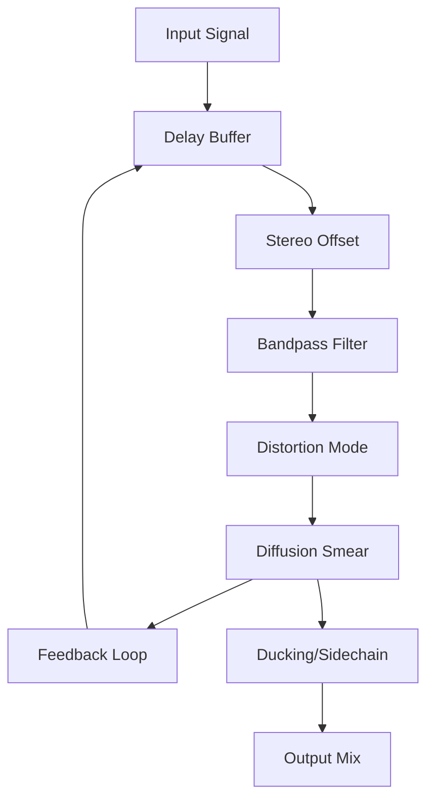

# Reference: Signal Flow Diagram (Delay 3)

Understanding the internal order of operations is key to mastering character delays.

## Key Points
1.  **Filter Before Distortion:** This means the distortion only saturates the frequencies you haven't cut.
2.  **Diffusion in the Loop:** Every time the sound repeats, it gets "blurrier."
3.  **Ducking is Last:** The sidechain reduces the *total* volume of the processed echoes before they hit the final mix.

### Logic Source
Based on internal signal path testing and official block diagrams. [SRC: IL-MAN]
