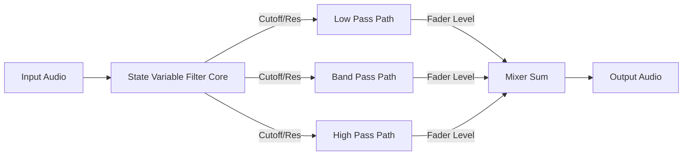

# Signal Flow: Fruity Filter

Fruity Filter processes the audio into three parallel streams based on the Cutoff Frequency.

### Stages
1.  **Input**: Audio enters the State Variable Filter core.
2.  **Filter Calculation**: The engine calculates the Low, Band, and High pass versions of the signal simultaneously based on the **Cutoff** and **Resonance**.
3.  **Mixing**: The user blends these three signals using the vertical sliders.
4.  **Output**: The summed signal.
