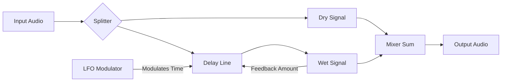

# Signal Flow: Fruity Flanger

The Flanger relies on a feedback loop to create its characteristic metallic resonance.

### Stages
1.  **Split**: Signal is duplicated.
2.  **Delay Line**: One copy is delayed by a tiny amount (0-10ms).
3.  **LFO**: The delay time constantly changes (modulates) based on the **Rate** and **Depth**.
4.  **Feedback**: A portion of the output is sent *back* into the input of the delay line. This reiteration creates the deep "comb filter" notches.
5.  **Mix**: Dry and Wet are combined.
