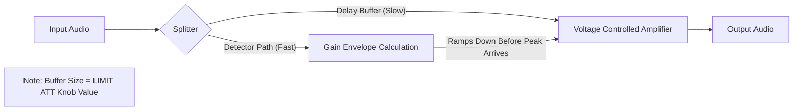

# Technical Specs: Fruity Limiter Mechanics

## 1. Lookahead Topology

One of the most misunderstood features of Fruity Limiter is how the `ATT` (Attack) knob on the **LIMIT** tab functions. It is **NOT** just an envelope generator; it is a **Time Machine**.

### The Problem with Zero Latency Limiting
If a limiter has 0ms latency, it must react to a peak the *instant* it happens.
1.  Peak exceeding 0dB arrives at T=0.
2.  Limiter detects it.
3.  Limiter reduces gain.
*   **Result:** Because the reaction acts *on* the peak, it inevitably distorts the wave shape (Clipping).

### The Lookahead Solution
When you increase the **LIMIT ATT** knob (e.g., to 5ms), Fruity Limiter creates an audio buffer.
1.  Audio enters the plugin.
2.  It is held in a "Buffer" for 5ms.
3.  A "Detector" signal skips the buffer and looks at the audio immediately.
4.  The Detector sees a peak coming 5ms in the future.
5.  The Detector tells the Gain Envelope to *start ramping down now*.
6.  By the time the audio leaves the buffer (5ms later), the gain is **already reduced**.
*   **Result:** Perfect, clean limiting with zero distortion.
*   **Cost:** 5ms of system latency (Lag).

### Diagram: Lookahead Path

---

## 2. Saturation Curve (Amplitude Distortion)

The **SAT** (Saturation) knob introduces a "Soft Knee" to the Limiter's brick wall.

*   **0% Saturation (Knob Right):**
    *   Transfer Curve is Linear (1:1) until 0dB.
    *   At 0dB, it hits a hard horizontal wall.
    *   Artifacts: Odd harmonics, harsh clicking on heavy reduction.

*   **50% Saturation (Knob Center):**
    *   Transfer Curve becomes Sigmoidal (S-Shape).
    *   As input approaches -3dB, the variable gain reduction begins.
    *   At 0dB, the curve flattens out smoothly.
    *   Artifacts: Even & Odd harmonics. "Rounding" of square waves.
    *   Psychoacoustics: Sounds louder and warmer.

---

## 3. Oversampling (Internal)

Fruity Limiter operates with internal logic that ensures inter-sample peaks are handled, though it does not offer a user-facing "Oversampling" switch like Fruity Filter. The precision of the envelope follower (Detector) allows for sub-sample accuracy when the **CURVE** tension is properly set.
