# Signal Flow: Fruity Parametric EQ

Audio passes through 7 distinct filter bands in series (or parallel calculation summed together).

```mermaid
graph LR
    Input[Input Audio] --> Band1[Band 1: Low Shelf/Cut]
    Band1 --> Band2[Band 2: Peaking]
    Band2 --> Band3[Band 3: Peaking]
    Band3 --> Band4[Band 4: Peaking]
    Band4 --> Band5[Band 5: Peaking]
    Band5 --> Band6[Band 6: Peaking]
    Band6 --> Band7[Band 7: High Shelf/Cut]
    Band7 --> GlobalGain[Output Gain]
    GlobalGain --> Output[Output Audio]
```

### Stages
1.  **Input**: Audio enters.
2.  **Series Processing**: The signal is shaped by each band sequentially.
3.  **Phase Shift**: Every EQ move introduces slight phase rotation. PEQ1 is a "Minimum Phase" EQ (not Linear Phase).
4.  **Output**: Final signal.
