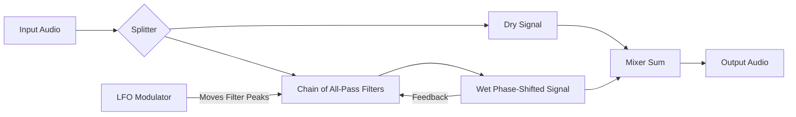

# Signal Flow: Fruity Phaser

Phasing is created by shifting the *phase* of the audio at specific frequencies using All-Pass Filters.

### Stages
1.  **Split**: Audio is copied.
2.  **All-Pass Filters**: These filters do not cut volume, but they change the *timing* (phase) of specific frequencies.
3.  **LFO**: Moves the frequencies affected by the All-Pass filters up and down.
4.  **Mix**: When the "Phase Shifted" signal is mixed with the "Dry" signal, frequencies that are out of phase cancel each other out, creating moving notches in the spectrum.
